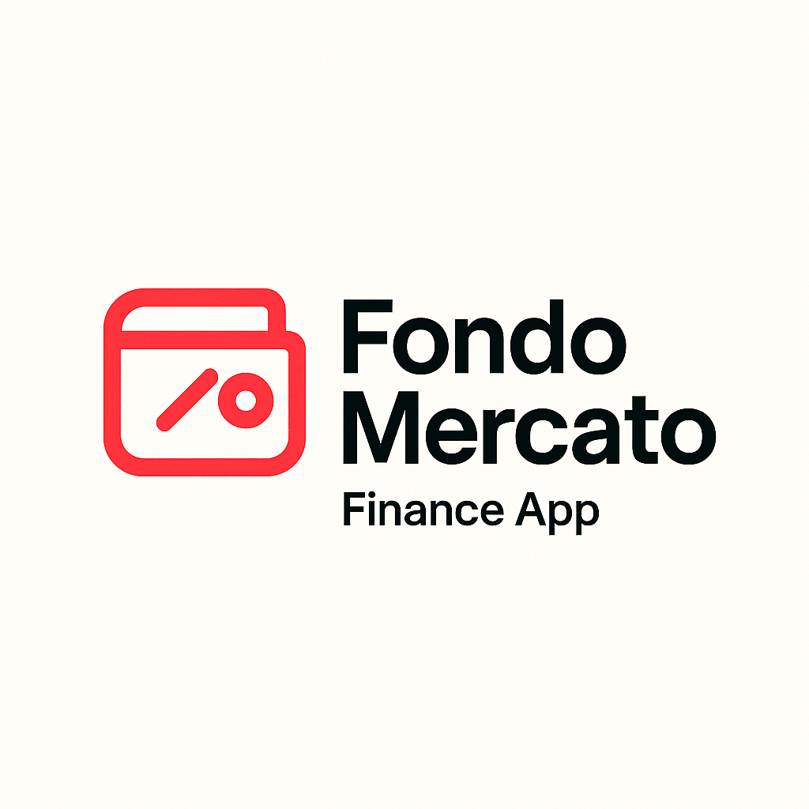

# Fondomercato

Fondomercato es una aplicación de gestión financiera personal diseñada para ayudarte a tomar el control de tus finanzas. Con una interfaz intuitiva y potentes funcionalidades, Fondomercato simplifica el seguimiento de tus ingresos y gastos, la creación de presupuestos y la comprensión de tus hábitos de gasto.

## ¿Cómo Funciona?

Fondomercato te permite registrar tus transacciones diarias, categorizarlas y asignarlas a presupuestos. La aplicación analiza tus datos para proporcionarte visualizaciones claras y perspicaces sobre tu situación financiera.

## Funcionalidades

*   **Seguimiento de Transacciones:** Registra fácilmente todos tus ingresos y gastos.
*   **Categorización:** Organiza tus transacciones con categorías personalizables.
*   **Presupuestos:** Crea y gestiona presupuestos para diferentes categorías de gasto.
*   **Informes y Estadísticas:** Obtén visualizaciones detalladas de tus patrones de gasto y progreso presupuestario.
*   **Sincronización en la Nube:** Accede a tus datos financieros desde cualquier dispositivo.

## Aspectos Destacados

*   **Interfaz de Usuario Amigable:** Diseño limpio y fácil de usar.
*   **Visualizaciones Claras:** Gráficos y tablas que te ayudan a entender tus finanzas de un vistazo.
*   **Personalización:** Adapta las categorías y presupuestos a tus necesidades.
*   **Seguridad:** Tus datos financieros están protegidos.

## Empezando

Para empezar a usar Fondomercato, simplemente regístrate y comienza a añadir tus transacciones. ¡Empieza a tomar el control de tu futuro financiero hoy mismo!

***

# Fondomercato

Fondomercato is a personal finance management application designed to help you take control of your finances. With an intuitive interface and powerful features, Fondomercato simplifies tracking your income and expenses, creating budgets, and understanding your spending habits.

## How it Works

Fondomercato allows you to record your daily transactions, categorize them, and assign them to budgets. The application analyzes your data to provide you with clear and insightful visualizations about your financial situation.

## Functionalities

*   **Transaction Tracking:** Easily record all your income and expenses.
*   **Categorization:** Organize your transactions with customizable categories.
*   **Budgeting:** Create and manage budgets for different spending categories.
*   **Reports and Statistics:** Get detailed visualizations of your spending patterns and budget progress.
*   **Cloud Synchronization:** Access your financial data from any device.

## Highlights

*   **User-Friendly Interface:** Clean and easy-to-use design.
*   **Clear Visualizations:** Charts and graphs that help you understand your finances at a glance.
*   **Customization:** Adapt categories and budgets to your needs.
*   **Security:** Your financial data is protected.

## Getting Started

To start using Fondomercato, simply sign up and begin adding your transactions. Start taking control of your financial future today!